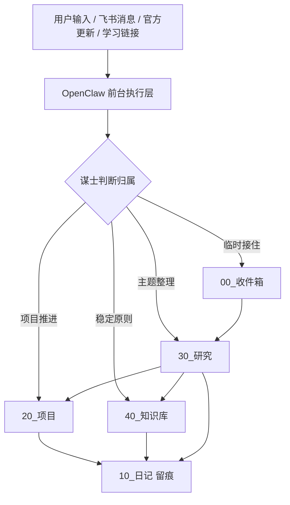

# OpenClaw与Obsidian整体架构与自动化链路

## 概述

这轮研究不是从零认识 `OpenClaw` 或 `Obsidian`，而是为 [[20_项目/OpenClaw与Obsidian自动化/OpenClaw与Obsidian自动化]] 做一次阶段收口。

一句话结论：

当前系统已经从“继续搭骨架”进入“可用闭环阶段”，下一阶段主线不该再横向扩能力，而应优先再跑 `1` 条真实自动化闭环，并把 `heartbeat` 收益观察与 `Obsidian CLI` 局部接入作为次级验证点。

## 核心概念

- [[40_知识库/01_系统设计/OpenClaw与Obsidian分工原则]]
- [[40_知识库/01_系统设计/自动化链路验证优先于能力扩张]]
- [[40_知识库/01_系统设计/OpenClaw与Obsidian项目研究收口原则]]

## 当前已确认的事实

### 事实

1. 本机当前 `openclaw --version` 返回：
   - `OpenClaw 2026.3.13 (61d171a)`
2. `OpenClaw` 官方 GitHub Releases 页面显示：
   - 截至 `2026-03-14`，最新 release 为 `openclaw 2026.3.13`
3. 本机 `Obsidian CLI` 已完成本机冒烟验证：
   - `obsidian version` 返回 `1.12.4 (installer 1.12.4)`
   - `obsidian daily:path` 返回 `10_日记/2026-03-22.md`
   - `obsidian read` 与一次真实 `append` 已跑通
4. `Obsidian` 官方 changelog 显示：
   - `2026-02-27` 发布 `1.12 Desktop`
   - 该版本正式引入 `Obsidian CLI`
5. 当前项目内部已经被真实样本验证过的链路包括：
   - 飞书前台正式落位
   - 无前缀链接学习进入 `30_研究`
   - 检索层“影子试点”默认顺序
   - 官方来源轻量巡检与分流

### 规律

- 当前项目的主要矛盾已经不是“工具有没有”，而是“哪些能力值得进入主线、哪些只该继续局部验证”。
- 一旦项目已经有项目页、研究页、知识卡、日记和验证记录，继续横向扩题的边际收益会明显下降，研究重点应转向收口、验证和取舍。

### 假设

- `Obsidian CLI` 已经证明本机可用；但它是否适合直接接入当前默认正式落盘链路，还需要继续做场景验证。
- `heartbeat` 已经从“空心跳”升级为“最小有效心跳”，但它是否真的节省了手动检查成本，仍需继续观察。

## 工作原理

当前最值得保留的系统理解不是“某个功能列表”，而是下面这条主链：



这条链里各层的职责应继续保持清晰：

- `OpenClaw`：负责理解、执行、分发、推进、调度和轻量验证
- `Obsidian`：负责正式沉淀、链接组织、验证留痕和长期回看
- `OrbitOS`：负责规定输入如何分流、输出如何回写、知识如何收口

## 当前自动化链路现状

### 已稳定能力

1. `飞书前台 -> 正式目录 -> 今日日记` 已经可用
2. 无前缀链接学习已能默认进入 `30_研究`
3. 官方来源已经形成轻量巡检和分流规则
4. 检索层已经形成“影子试点”，但仍保持轻量，不扩成新工程

### 待验证能力

1. `heartbeat` 是否真的减少漏项和手动检查
2. 视频内容获取能否进入默认工作流
3. 多 Agent 长时间运行的稳定性
4. `Obsidian CLI` 是否值得从“低风险追加写入”继续扩到更正式的默认落盘链路

### 当前不优先能力

1. 自动批量抓全网
2. 大规模接入新的检索基础设施
3. 让 `OpenClaw` 过早接管所有生成链和旁支链路

## 两个外部官方信号的意义

### 1. OpenClaw 官方 release

截至 `2026-03-14`，官方最新 release 是 `openclaw 2026.3.13`。  
这次更新里，和当前项目最相关的不是“功能变多了”，而是它继续碰到了你现在真正关心的运行问题：

- `OPENCLAW_TZ` 时区支持
- 事件 / 投递去重修复
- 会话与跨 Agent 行为修复

它更像“项目输入”，因为它直接影响现有运行链路是否更稳。

### 2. Obsidian 官方 CLI

`Obsidian 1.12 Desktop` 于 `2026-02-27` 正式引入 `Obsidian CLI`。  
官方帮助文档已经明确给出：

- `obsidian daily:append`
- `obsidian append`
- `obsidian create`
- `obsidian move`

这说明 `Obsidian` 已经不只是“被动知识库”，而是拥有了更明确的终端自动化入口。  
但对当前项目来说，它暂时更像“局部试接能力”，因为虽然本机冒烟验证已经通过，但“接入哪一段链路最值”仍需要继续取舍。

## 示例

### 示例一：当前最合理的最小闭环

```text
飞书发来链接或素材
-> 谋士判断并落到 00_收件箱 / 30_研究
-> 形成 1 篇研究笔记
-> 提炼 1 条知识卡
-> 回写项目下一步
-> 今日日记留痕
```

这条链已经比“继续解释系统架构”更接近项目真实收益。

### 示例二：官方更新的正确分流

- `OpenClaw release`
  - 优先判断是否影响当前项目链路
  - 更适合先落 `20_项目`
- `Obsidian CLI`
  - 优先判断是否值得进入默认自动化动作
  - 更适合先落 `30_研究`

## 最佳实践

1. 保持“半自动、真可落地”的主线，不追求一次性全自动
2. 先验证一条链有没有真实收益，再决定是否扩能力
3. 把官方更新先做影响分级，再决定进日记、研究还是项目
4. 让 `OpenClaw` 负责执行与推进，让 `Obsidian` 负责正式沉淀与可追溯
5. 当研究材料已经很多时，优先做收口和阶段判断，不继续横向开新题

## 常见陷阱

1. 把“命令存在”误当成“已接入工作流”
2. 把“heartbeat 已启动”误当成“已经带来自动化收益”
3. 把“主链路可用”误当成“整套系统已经生产级”
4. 在真实闭环还没多跑几轮前，就继续扩视频抓取、检索基础设施或生成链

## 正式结论

### 事实结论

- 当前项目已经完成从“纯概念分工”到“可用闭环”的跃迁
- 本机 `OpenClaw` 版本已经和 `2026-03-14` 官方最新 release 对齐
- 本机 `Obsidian CLI` 已完成最小可用验证

### 规律结论

- 当前最值钱的动作不是“继续知道更多功能”，而是“再跑一轮真实闭环并观察收益”
- 一旦项目进入“多文档、多规则、多验证记录”阶段，研究的正确动作应从扩张转为收口

### 下一步建议

1. 继续跑 `1` 条真实学习素材闭环，并强制产出 `研究 -> 知识 -> 项目动作`
2. 观察 `heartbeat` 一天，判断它是否真的减少漏项
3. 继续按低风险顺序试接 `Obsidian CLI`
   - 更适合先试：日记追加、读取文件、创建研究草稿
   - 不适合先试：全链路重构、复杂批量改写

## 相关阅读

- [[20_项目/OpenClaw与Obsidian自动化/OpenClaw与Obsidian自动化]] - 当前项目总表
- [[20_项目/OpenClaw与Obsidian自动化/03_自动化链路设计]] - 第一条最小链路定义
- [[20_项目/OpenClaw与Obsidian自动化/13_生产级部署计划]] - 当前生产级验证主线
- [[20_项目/OpenClaw与Obsidian自动化/14_生产级部署阶段复盘]] - 阶段判断与边界
- [[99_系统/归档/研究/2026/03/02_OpenClaw多Agent协作流程设计]] - 多 Agent 角色分工
- [[99_系统/归档/研究/2026/03/heartbeat阶段判断_2026-03-22]] - heartbeat 收益边界
- [[99_系统/归档/研究/2026/03/检索层试点阶段判断_2026-03-22]] - 检索层影子试点结论
- [[99_系统/归档/研究/2026/03/官方来源纳入日常学习流_2026-03-22]] - 官方源轻量巡检流程
- [[99_系统/归档/研究/2026/03/官方来源真实样本分流验证_2026-03-22]] - 官方源的项目/研究分流验证
- [[99_系统/归档/研究/2026/03/Obsidian_CLI最小试接方案_2026-03-22]] - CLI 本机验证与局部试接建议

## 参考资源

- [OpenClaw Releases](https://github.com/openclaw/openclaw/releases)
- [Obsidian Changelog](https://obsidian.md/changelog/)
- [Obsidian CLI Help](https://help.obsidian.md/cli)
