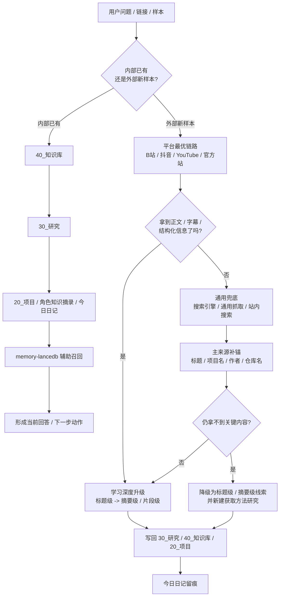

# 当前检索路径图

## 一句话结论

你现在并不是完全没有默认检索路径，而是路径已经散落在 `知识库 / 研究 / 项目 / 记忆 / 平台链路 / 搜索补锚` 这些层里。先把它画清楚，后面才知道哪一段值得交给 `OpenViking` 试点。

## 当前默认顺序

1. 先判断：这是“内部已有问题”还是“外部新样本”
2. 如果是内部已有：先查显性知识层，再查研究层，再查项目层和角色层，最后用记忆层补充
3. 如果是外部新样本：先走平台最优链路，再走通用兜底，再回主来源补锚
4. 如果还是拿不到关键内容：降级学习深度，并转成获取方法研究
5. 最后把结果写回 `30_研究 / 40_知识库 / 20_项目`，并在今日日记留痕

## 当前检索路径图

## 现在最常用的 7 个入口

- `40_知识库`：找稳定原则、系统规则、长期可复用结论
- `30_研究`：找主题整理、对标、推演、样本与阶段判断
- `20_项目`：找当前目标、约束、待验证动作和阶段判断
- `角色知识摘录`：找某个 Agent 反复做事沉淀出的经验
- `memory-lancedb`：补用户偏好、近期上下文和轻量长期记忆
- 平台最优链路：拿正文、字幕、结构化字段和一手入口
- 搜索与主来源补锚：在原链接受阻时继续定位到官方答案页

## 这张路径图解决什么

- 把“先去哪找”从临场判断变成默认顺序
- 把“为什么这次命中了”拆成可以记录的路径
- 把“内部检索”和“外部补锚”放到同一张运行图里

## 当前最不稳定的 3 段

### 1. 平台最优链路的稳定性

- B站、抖音、YouTube 的获取方式并不完全一致
- 同一平台也可能受 cookies、登录态、分享链格式影响

### 2. 命中轨迹的留痕

- 你现在大多能留下“结果”
- 但还缺“本轮到底走了哪几步”的标准记录

### 3. 跨层读取的停止条件

- 什么时候只看 `40_知识库`
- 什么时候要继续下钻 `30_研究`
- 什么时候应停止内部检索，转去外部补锚

## 这张图和 OpenViking 的关系

| 当前路径段 | 当前状态 | OpenViking 可能补的点 |
|---|---|---|
| 内部多层检索 | 已有但顺序还不够硬 | 分层加载更清楚 |
| 外部样本补锚 | 已有但链路容易分散 | 统一入口和上下文组织 |
| 命中理由记录 | 结果多，路径少 | 检索轨迹更可观测 |
| 跨层停止条件 | 主要靠经验判断 | 运行时加载边界更明确 |

## 当前最推荐的下一步

现在不急着装新系统，更值的是：

1. 用这张路径图当默认顺序
2. 给每次关键检索补一张“检索轨迹记录”
3. 连续跑 3 个真实样本，再判断是否值得做 `OpenViking` 检索层试点

## 关联

- [[99_系统/归档/研究/2026/03/当前检索层的3个最痛点_2026-03-22]]
- [[99_系统/归档/研究/2026/03/OpenViking最适合替代哪一层_2026-03-22]]
- [[99_系统/归档/研究/2026/03/OpenViking检索层最小试点方案_2026-03-22]]
- [[99_系统/模板/检索轨迹记录模板]]
- [[99_系统/链接学习筛选与去重规则]]
